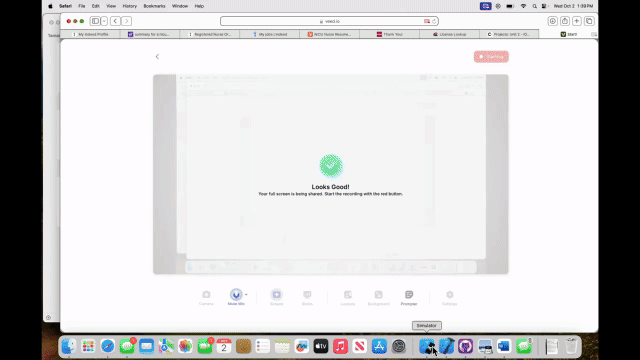

# BeReal Clone PT 1 - A Social Photo Sharing App

**BeReal Clone PT 1** is an early version of a mobile app that replicates the core features of the popular BeReal app. The app encourages users to post photos of what they're currently doing when prompted by a random notification. After uploading their photo, users can view posts from their friends. The app also includes basic features such as user registration and login, as well as a feed where users can scroll through their friends' posts.

Whether you're looking to share spontaneous moments or engage with friends’ photos, this app creates a simple, engaging way to interact with others through real-time photo uploads.

- Developer: Noah Russell
- Development Time: 3 hours
- Technologies Used: Swift, UIKit, Back4App, Xcode

## Features

The following required features have been successfully implemented:

- [✅] App Icon: The app displays an icon on the home screen and includes a styled launch screen.
- [✅] User Registration: Users can create a new account to begin using the app.
- [✅] User Login: Users can log in to their account with previously created credentials.
- [✅] Feed View: Upon login, users can see a feed displaying posts from their friends.
- [✅] Photo Upload: Users can select a photo from their library and add an optional caption to their post.
- [✅] User Logout: Users can log out of their account when they’re finished using the app.

## Optional Features

The following optional features are planned for future versions:

- [❌] Pull-to-Refresh: Allow users to refresh their feed and see new posts with a loading indicator.
- [❌] Location Data: Display the location of the uploaded photo in the feed.
- [❌] Persistent Login: Allow users to remain logged in even after closing and reopening the app.

## Future Enhancements

Potential future features include:

- [🔲] Photo Comments: Implement the ability for users to comment on posts.
- [🔲] Photo Editing: Enable users to edit their photos before posting, including basic filters or cropping.
- [🔲] Push Notifications: Add push notifications to remind users when to post photos or when new posts are available.

## Setup Instructions

To run the BeReal Clone PT 1 app locally, follow these steps:

1. Clone the Repository:
   - `git clone https://github.com/your-username/BeReal-Clone-PT1.git`
   - `cd BeReal-Clone-PT1`
2. Open in Xcode:
   - Open the `.xcodeproj` or `.xcworkspace` file in Xcode.
3. Install Dependencies:
   - If using Back4App or other third-party libraries, follow their setup instructions.
4. Build and Run:
   - Select your desired simulator or a physical iOS device.
   - Click the “Run” button in Xcode to build and launch the app.
5. Test:
   - Register a new account, upload a photo, and view posts in the feed.
   - Test logging in and out to ensure smooth transitions.

## Video Walkthrough

Here’s a quick demonstration of the app’s core features:

GIF created with VEED.io.

## Development Process

This app was built using UIKit, providing a simple interface that supports user registration, login, and photo posting. The app uses Back4App for backend services to handle user data and posts. The feed is dynamic, displaying posts in chronological order and supporting basic user interactions.

## Challenges Faced

- **Backend Integration:** Configuring Back4App and ensuring smooth communication between the front-end app and the backend.
- **Feed Management:** Implementing a smooth feed scroll and handling large sets of data from multiple users.

## Key Takeaways
- Learned how to integrate a backend service like Back4App to store user data and posts.
- Gained experience with implementing basic social features like user login, photo uploads, and feed management.
- Enjoyed building the foundation for a social photo-sharing app that could be expanded in future iterations.

## Technologies Used

- Programming Language: Swift
- Frameworks: UIKit
- Backend: Back4App
- Development Environment: Xcode 14.0+
- Version Control: Git, GitHub

## License

BeReal Clone PT 1 is licensed under the Apache License 2.0.  
You may obtain a copy of the license at:  
http://www.apache.org/licenses/LICENSE-2.0

